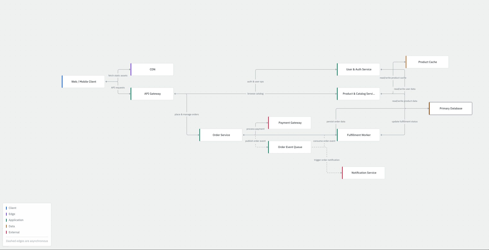

# arkit

Describe a system in plain English, get a rendered high-level architecture diagram.

**Live:** [archiq.me](https://archiq.me) · **API:** `api.archiq.me`



---

## What it does

You type something like *"a food delivery platform where customers order from
restaurants and riders deliver"*. The backend sends it to an LLM with a
constrained system prompt, parses the response into a fixed graph schema,
validates it, caches it, and returns JSON. The frontend lays the graph out
automatically and draws it on an interactive canvas.

Typical output is 11–15 nodes and 12–18 edges — small enough to read, detailed
enough to be useful.

## Stack

| | |
|---|---|
| Backend | Java 25, Spring Boot 4.1.1, Maven |
| Database | PostgreSQL 18, Flyway migrations |
| Frontend | React, TypeScript, Vite, React Flow, dagre |
| LLM | Anthropic Claude, behind a provider-agnostic interface |
| CI/CD | GitHub Actions → GitHub Container Registry → cron pull |
| Hosting | Frontend on Cloudflare Pages; backend self-hosted behind Cloudflare Tunnel |

## Architecture

```
Browser ──► Cloudflare Pages (static React app)
   │
   └──► api.archiq.me ──► Cloudflare Tunnel ──► home server
                                                   │
                                        ┌──────────┴──────────┐
                                        │  Spring Boot (API)  │
                                        │  rate limit         │
                                        │  cache lookup       │
                                        │  LLM call           │
                                        │  parse + validate   │
                                        └──────────┬──────────┘
                                                   │
                                            PostgreSQL 18
```

Request path: rate-limit interceptor → validation → cache lookup by description
hash → LLM call on miss → parse → validate → persist → respond.

## The graph schema

The whole product depends on the LLM producing one fixed shape. Free-text node
types were rejected early — the renderer needs a known set to pick colours and
icons, and LLMs produce several spellings of the same concept.

```jsonc
{
  "nodes": [
    {
      "id": "api-gateway",          // lowercase kebab-case
      "label": "API Gateway",
      "type": "GATEWAY",            // one of 13 fixed values, OTHER as fallback
      "layer": "EDGE",              // CLIENT | EDGE | APPLICATION | DATA | EXTERNAL
      "description": "Routes requests and terminates TLS"
    }
  ],
  "edges": [
    {
      "from": "api-gateway",
      "to": "shortener-service",
      "label": "route request",
      "protocol": "HTTP",           // free text, display only
      "direction": "ONE_WAY",       // ONE_WAY | BIDIRECTIONAL
      "communication": "SYNC"       // SYNC | ASYNC
    }
  ]
}
```

`direction` and `communication` are kept as independent axes rather than one
combined enum — combining them produces a cross-product of values that mostly
never occur.

## Notable engineering

**Prompt constrained by measurement, not guesswork.** The first prompt produced
unrenderable hairballs — 23 nodes and 43 edges for Google Drive. Three changes
(a node cap, explicit semantics for `direction` and `communication`, and an id
format rule) brought three test systems to 11/15, 12/18 and 12/17 nodes/edges,
with zero dangling edge references and zero invalid enums across all runs.
Numbers are in [ADR 0003](docs/adr/).

**LLM output is treated as untrusted input.** The parser extracts JSON
defensively (first `{` to last `}`, so markdown fences and leading prose don't
break it) rather than trusting the prompt's formatting instruction. Enums
deserialize case-insensitively with a documented fallback. The validator drops
edges referencing nonexistent nodes and logs the count, returning a partial
graph rather than failing the request.

**Rate limiting: sliding window log, 15 requests per 10 minutes per caller.**
Fixed windows allow a 2× burst at the boundary, which matters when each request
costs money at the LLM provider. Counters live in a Caffeine cache with
`expireAfterAccess`, so abandoned entries expire without a cleanup thread.
Per-key updates run inside `ConcurrentHashMap.compute` to make the check-and-
increment atomic.

**IPv6 keys are normalised to the /64 prefix.** A single client is routinely
allocated 2^64 addresses, so per-address limiting on IPv6 is no limit at all.
Addresses are parsed to bytes rather than split on `:`, since `::` compression
makes string parsing wrong.

**Exact-match caching on a hash of the description.** Descriptions are up to
1000 characters — too long to index directly — so they are normalised, hashed
with SHA-256, and the hash carries a unique constraint. Concurrent first-time
requests for the same description are resolved by catching the constraint
violation and returning the winner's row, so one description always maps to one
graph.

**Layout is derived from edges, not from the `layer` field.** `layer` is
semantic, not positional: a cache sits in the DATA layer but is one hop from the
application tier. Forcing layers into columns stretches edges across the canvas.
dagre ranks nodes from the actual edge structure, and `layer` drives colour
instead.

**Deployment is pull-based.** GitHub Actions builds and pushes an image tagged
with the commit SHA; a cron job on the server pulls and restarts. The server
never holds GitHub credentials, and the build never runs on the production host.

## Testing

- Unit tests for the parser, graph validator, and rate limiter (including the
  IPv6 /64 collapsing).
- A Testcontainers integration test that boots a real PostgreSQL container, runs
  the Flyway migrations, and exercises the cache path with only the LLM mocked —
  verifying that a repeated description skips the LLM entirely and returns the
  same row.

Tests gate the deploy: a failure in CI blocks the image push.

## Architecture decision records

Every significant decision is recorded with the option chosen, the main option
rejected, and the reason. See [`docs/adr/`](docs/adr/):

| | |
|---|---|
| 0001 | The diagram schema |
| 0002 | Orthogonal edge axes |
| 0003 | Prompt constraints, with before/after measurements |
| 0004 | Separate React frontend |
| 0005 | Deployment architecture |

## Running locally

Requires JDK 25, Node 20+, and Docker.

```bash
# database
docker compose -f deploy/docker-compose.yml -f deploy/compose.override.yaml \
  --env-file deploy/.env up -d db

# backend — needs ANTHROPIC_API_KEY in the environment
cd backend && ./mvnw spring-boot:run

# frontend
cd frontend && npm install && npm run dev
```

The frontend reads its API URL from `VITE_API_URL` (`.env.development` points at
`localhost:8080`).

## API

```
POST /api/v1/architectures
Content-Type: application/json

{ "description": "a URL shortener with caching and analytics" }
```

| Status | Meaning |
|---|---|
| 200 | Graph returned |
| 400 | Description missing, or outside 20–1000 characters |
| 429 | Rate limited; `Retry-After` header gives seconds |
| 500 | Generation failed |

## Known limitations

- The backend runs on a single self-hosted machine with no battery backup, so a
  power cut means downtime until it is manually powered on.
- The cache is exact-match. "A link shortener" and "a URL shortener" produce two
  separate LLM calls. Semantic matching via embeddings is the natural next step.
- Generated diagrams cannot yet be edited or refined — each generation is
  independent.